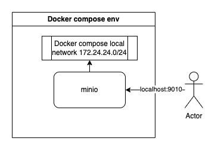

# docker compose with minio for development

## Diagram


## CLI
- run docker compose env
```bash
./docker_env.sh up
```
- destroy docker compose env
```bash
./docker_env.sh down
```

Local minio UI url: http://localhost:9010
